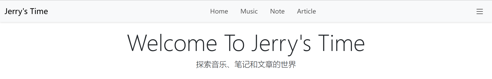
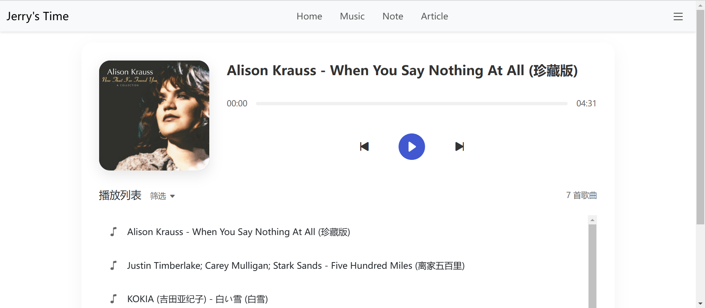

## 项目概述

- **项目效果**

    

    

- **来源**：独立项目
- **文件**：

    - **后端**：`run.py` `__init__.py` `forms.py` `models.py` `routes.py` `config.py`
    - **数据库**：MySQL
    - **前端**：`templates` `static`

- **概述**：这是一个练习项目，后端采用 Flask 框架，数据库使用 MySQL，前端没有使用框架。
- **功能**：

    - 每个页面都有公共部分。
    - 真实注册和登录。
    - 登录以后记录登录状态，原登录按钮显示为用户名。
    - 可以退出登录，切换登录状态。
    - 首次实现音乐界面，可以根据音乐文件展示专辑封面和筛选标签。

- **存储**

    - 代码存储在 Git 托管平台：前后端合并存储 `blog-flak-mysql-html`
    - 无镜像存储在 DockerHub
    - 没有在 `projects` 中整理